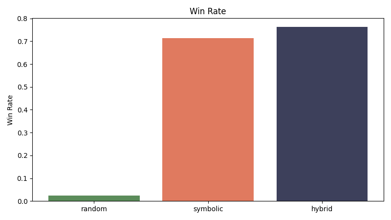
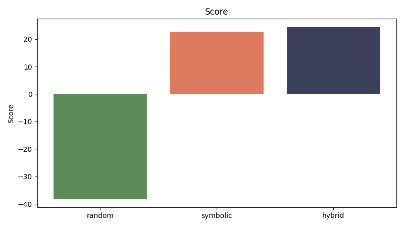
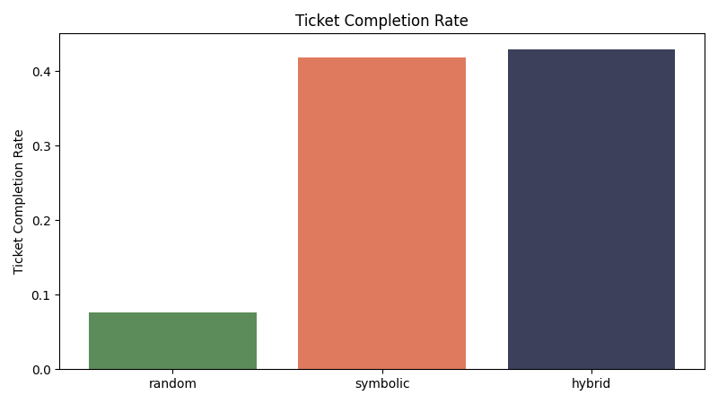

# Neuro-Symbolic Ticket to Ride

A research implementation of a 2-player Ticket to Ride game engine in Python 3.11, built to compare three AI agent architectures: random, pure symbolic, and hybrid neuro-symbolic. The hybrid agent achieves a **76.25% win rate** across 80 games, outperforming the symbolic-only baseline by 5 percentage points.

## Overview

This project implements a complete, rule-enforcing Ticket to Ride game engine and uses it as a controlled testbed for comparing AI decision-making strategies. The core research question: does combining weighted feature scoring with symbolic graph reasoning outperform either approach alone?

The hybrid agent wins more, scores higher, and completes more destination tickets than both baselines across reproducible, seeded tournament runs — with zero illegal moves rejected across all 240 games.

## Architecture

### Game Engine (`ttr_nsai/engine/`)

- Fully rule-enforcing engine built on immutable dataclasses — `Route`, `DestinationTicket`, `Action`, `GameState`
- Clean `apply_action` / `execute_turn` separation: illegal moves are caught, logged to the player's illegal move counter, and gracefully fall back to a card draw rather than crashing
- End-game detection with a final-round countdown and tiebreaker resolved by ticket completion count
- Seeded `random.Random` for fully reproducible experiment runs

### Symbolic Reasoner (`ttr_nsai/symbolic/`)

- Dijkstra shortest-path solver that computes remaining ticket distance over the live route graph, respecting claimed and opponent-blocked routes
- `ticket_progress_delta` — measures how much claiming a given route reduces remaining distance across all of the active player's open tickets; a route that connects a previously disconnected path scores +5.0
- `blocking_value` — runs the same delta calculation from the opponent's perspective, quantifying how much claiming a route hurts their ticket graph
- `strategic_adjustment` — rule-based modifier applied on top of base scores: penalizes off-plan routes, rewards connectors when no claimable routes remain
- Pre-computes all baseline city-pair distances at initialization so per-turn delta calculations stay fast

### Agent Hierarchy (`ttr_nsai/ai/`)

| Agent | Strategy |
|---|---|
| `RandomAgent` | Selects uniformly from the legal action set |
| `SymbolicHeuristicAgent` | Ranks all legal actions by `StrategicAssessment` score (symbolic reasoning only) |
| `HybridNeuroSymbolicAgent` | Dot product of an 8-feature vector × hand-tuned weights, combined with the symbolic adjustment |

The hybrid agent's `FeatureVector` captures: `route_points`, `route_length`, `ticket_progress`, `card_pressure`, `destination_draw_value`, `train_draw_value`, `endgame_pressure`, and `block_value`. Each decision emits a ranked **decision trace** showing the top 3 candidates with their decomposed heuristic and symbolic score components.

### Experiment Runner (`ttr_nsai/experiments/`)

- Round-robin tournament runner across all agent pairings
- 16 per-game metrics tracked: win/loss, score, tickets completed, avg decision time, illegal move count, prevented illegal claims, game length, and more
- Outputs: `metrics.csv`, `summary.json`, and 9 matplotlib plots saved to `artifacts/`
- `--trace-file` flag writes a full decision trace for one sample game

## Project Structure

```
nsai-ticket-to-ride/
├── ttr_nsai/
│   ├── engine/          # Game rules, state machine, action execution, scoring
│   ├── symbolic/        # Dijkstra reasoner, strategic assessment, action legality
│   ├── ai/              # Random, symbolic, and hybrid agents + factory
│   ├── experiments/     # Tournament runner, CSV/JSON writer, matplotlib plots
│   ├── ui/              # CLI interface and pygame board rendering
│   └── data/            # Board definition: routes, destination tickets, train deck
├── tests/               # pytest suite — 6 test modules
├── artifacts/           # Experiment outputs: metrics.csv, summary.json, plots
└── pyproject.toml
```

## Installation

Requires **Python 3.11+**.

```bash
git clone https://github.com/noaboa07/nsai-ticket-to-ride.git
cd nsai-ticket-to-ride

python -m venv .venv
.venv\Scripts\activate          # Windows
# source .venv/bin/activate     # macOS / Linux

pip install -e .[dev]
```

Optional pygame UI:

```bash
pip install -e .[pygame]
```

## Usage

### CLI Gameplay

```bash
# Watch the hybrid agent play with a printed decision trace
python -m ttr_nsai.ui.cli --agent hybrid --trace

# Run with the symbolic agent
python -m ttr_nsai.ui.cli --agent symbolic

# Available agents: random | symbolic | hybrid
```

### Run Experiments

```bash
# 20-game round-robin tournament (all 3 agents), with a sample trace file
python -m ttr_nsai.experiments.run_experiments \
  --games 20 --seed 42 --trace-file sample_trace.txt

# Reproduce the published results (80 games per agent)
python -m ttr_nsai.experiments.run_experiments \
  --games 20 --seed 42 --agents random symbolic hybrid
```

Results are written to `artifacts/`: `metrics.csv`, `summary.json`, and per-metric plots.

### Run Tests

```bash
pytest
# or for verbose output:
pytest -v
```

## Results

80-game round-robin tournament — seed 42, 20 games per ordered matchup:

| Agent | Win Rate | Avg Score | Ticket Completion | Avg Decision Time |
|---|---|---|---|---|
| Random | 2.5% | −38.2 | 7.6% | 0.07 ms |
| Symbolic | 71.3% | +22.6 | 41.9% | 2.75 ms |
| **Hybrid** | **76.3%** | **+24.3** | **42.9%** | 3.85 ms |

Key findings:

- The **random agent** rarely wins and scores negative on average — it frequently fails to complete destination tickets, which carry a point penalty on non-completion
- The **symbolic agent** wins 71% of games purely through graph-based ticket reasoning and opponent blocking, with no learned component
- The **hybrid agent** adds 5 percentage points over symbolic by incorporating endgame pressure and card efficiency into its scoring, at a cost of roughly 1 ms per decision
- **Zero illegal moves** were rejected across all 240 games — the symbolic filter eliminates illegal candidates before selection

### Win Rate by Agent


### Score Distribution


### Ticket Completion Rate


## Test Suite

| Module | What It Covers |
|---|---|
| `test_engine` | State initialization, action application, turn advancement, fallback behavior |
| `test_rules` | Route claim legality, wild card substitution, double-claim prevention |
| `test_scoring` | Destination ticket scoring, longest route bonus, tiebreaker logic |
| `test_endgame` | Final round trigger, countdown, winner resolution |
| `test_agents` | Decision validity and trace output across all three agent types |
| `test_cli` | CLI argument parsing and formatted output |

## Tech Stack

| Component | Library / Tool |
|---|---|
| Language | Python 3.11+ |
| Game engine & agents | Pure Python (dataclasses, `heapq`, `typing`) |
| Experiment visualization | matplotlib 3.8+ |
| Test suite | pytest 8.0+ |
| Optional UI | pygame 2.5+ |
| Packaging | setuptools / `pyproject.toml` |
