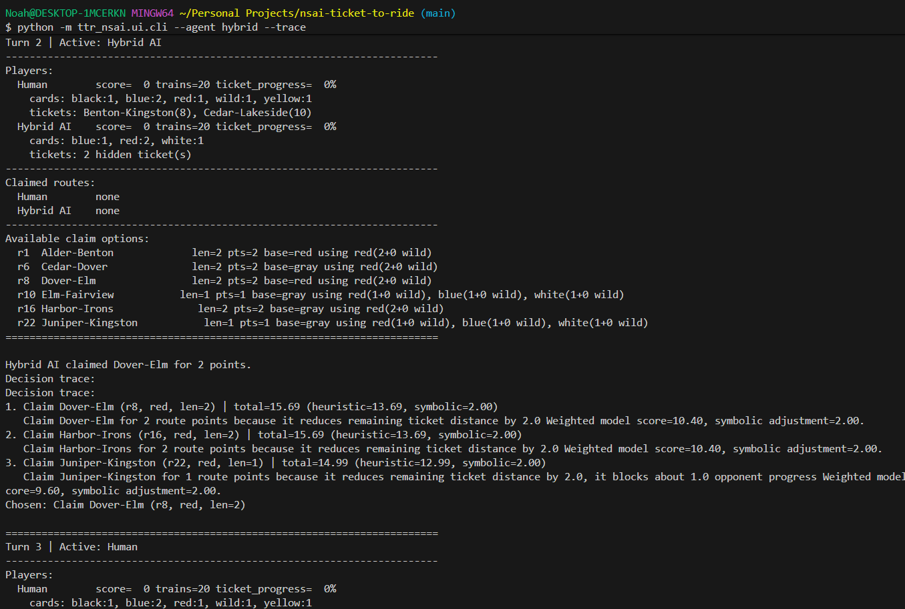
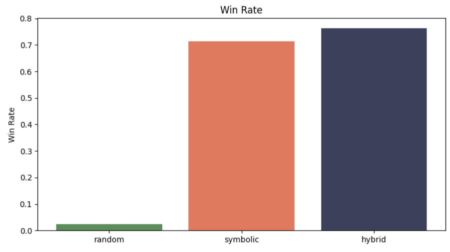

# Neuro-Symbolic Ticket to Ride

A simplified 2-player Ticket to Ride implementation in Python with:

- modular game engine
- symbolic reasoning layer
- random, symbolic, and hybrid neuro-symbolic agents
- CLI gameplay
- experiment runner and plotting
- pytest coverage

## Quickstart

```bash
python -m venv .venv
.venv\Scripts\activate
pip install -e .[dev]
python -m ttr_nsai.ui.cli --agent hybrid --trace
python -m ttr_nsai.experiments.run_experiments --games 50 --seed 7 --trace-file sample_trace.txt
pytest
```

## Highlights

- strict route-claim legality shared across symbolic filtering, CLI display, and engine execution
- destination-ticket reasoning based on shortest-path style progress reduction
- compact decision traces suitable for screenshots and writeups
- experiment outputs in both `CSV` and `JSON`, plus matplotlib plots

## Results

Across 80-game matchups:

- Random agent: ~2.5% win rate, negative average score
- Symbolic agent: ~71% win rate, strong ticket completion
- Hybrid agent: ~76% win rate, best overall performance

The hybrid approach outperforms both baselines by combining:
- symbolic reasoning (constraints + ticket planning)
- heuristic evaluation (flexibility + scoring)

This demonstrates the effectiveness of neuro-symbolic AI in structured decision-making environments.

## Demo

### CLI Gameplay with Neuro-Symbolic Reasoning


### Win Rate Comparison
